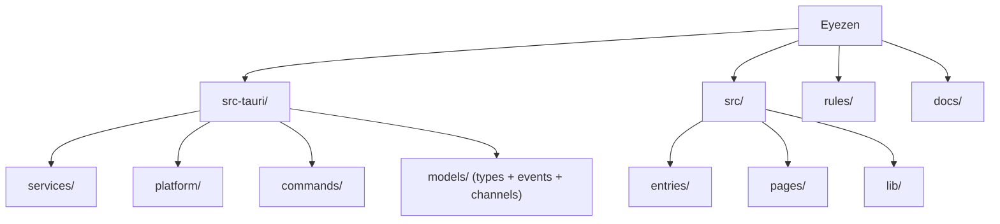

# Eyezen

基于 20-20-20 规则的跨平台桌面护眼工具。

- 开源 (MIT)，社区驱动
- 跨平台：Windows / macOS / Linux
- 面向技术用户（细粒度控制）和普通用户（开箱即用）

---

## 项目状态

**当前阶段：Phase 2 增强进行中。**

- Phase 1 MVP 代码已废弃，仅保留架构经验和设计决策
- 脚手架已就绪：Tauri v2 + Svelte 5 + Vite 6 + TailwindCSS v4
- 后端 MVP 已实现：6 个核心服务 + Commands + Events + Platform + Models
- 前端原型已实现：ts-rs 类型桥接 + IPC stores + tray-panel + tip-window + tip-minimal
- E2E 测试通过：完整用户流程验证（Working → PreAlert → Alerting → Resting → Working）
- Settings UI + About 页面已实现（Plan 010）
- i18n 已实现：全栈 zh-CN/en 双语 + 热切换（Plan 011）
- 主题切换已实现：Dark/Light CSS 变量 + 原生标题栏适配（Plan 012）
- 开机自启动已实现：tauri-plugin-autostart 集成（Plan 013）
- 下一步：Phase 2 继续（Statistics / 离席检测 / 工作日调度）

---

## 技术栈（版本锁定）

| 层 | 选型 | 版本约束 | 实际版本 | 说明 |
|---|------|---------|---------|------|
| 框架 | Tauri | v2 (`~2.x`) | `~2.10` | 跨平台，Rust 后端 |
| 前端 | Svelte 5 (Runes) | `~5.x` | `~5.54.0` | 零运行时编译 |
| 构建 | Vite | `~6.x` | `~6.4.1` | 快速 HMR |
| CSS | TailwindCSS | v4 (`~4.x`) | `~4.2.1` | 工具类优先 |
| 图表 | ECharts | tree-shaken | 未安装 (P2) | |
| 自启动 | tauri-plugin-autostart | `~2.2` | `~2.2` | 开机自启 |
| 数据库 | SQLite | via sqlx | 未安装 (P2) | |
| 配置 | TOML | 人类可读 | `~0.8` | |
| 类型桥接 | ts-rs | 最新稳定 | `~10` (dev-dep) | Rust → TS |
| 日志 | tracing + 日轮转 | -- | `~0.1` / `~0.3` / `~0.2` | tracing + subscriber + appender |
| 音频 | rodio | 独立线程 | `~0.20` | |
| 序列化 | serde + serde_json | `~1.0` | `~1.0` | |
| 异步 | tokio | `~1.x` | `~1.50` (full) | |
| 测试 | Vitest | `~3.x` | `~3.2.4` | |
| 类型检查 | svelte-check | `~4.x` | `~4.4.5` | |

---

## 架构总览

```
Frontend (Svelte 5, per window)
  ├── invoke()  → Rust Commands (thin layer)
  └── listen()  ← Rust Events (typed emit)
                       │
                  AppServices (Arc, Tauri State)
                  ├── ConfigService    TOML 读写 + watch channel
                  ├── TimerService     纯函数状态机 + tokio timer
                  ├── DetectorService  全屏检测 (MVP)
                  ├── WindowService    多显示器 tip-window
                  ├── SoundService     rodio 独立线程
                  ├── TrayService      托盘菜单 + tooltip
                  ├── StatService      SQLite (P2)
                  └── I18nService      语言切换 (P2)
```

详细架构约束见 → [`rules/01-architecture.md`](rules/01-architecture.md)

---

## 模块结构



### 模块索引

| 模块 | 路径 | 状态 | 职责 |
|------|------|------|------|
| Rust 入口 | `src-tauri/src/main.rs`, `lib.rs` | 已实现 | Tauri Builder 启动 + 服务编排 |
| ConfigService | `src-tauri/src/services/config.rs` | 已实现 | TOML 配置读写 + arc-swap 热更新 |
| TimerService | `src-tauri/src/services/timer/` | 已实现 | 纯函数状态机 + tokio timer loop |
| DetectorService | `src-tauri/src/services/detector.rs` | 已实现 | 全屏检测 (平台委托) |
| WindowService | `src-tauri/src/services/window.rs` | 已实现 | 多显示器 tip-window 管理 |
| SoundService | `src-tauri/src/services/sound.rs` | 已实现 | rodio 独立线程 + mpsc |
| TrayService | `src-tauri/src/services/tray.rs` | 已实现 | 托盘菜单 + tooltip + i18n 热切换 |
| StatService | `src-tauri/src/services/stat.rs` | 计划 (P2) | SQLite 统计 |
| I18nService | `src-tauri/src/services/i18n.rs` | 已实现 | zh-CN/en 双语 + 托盘翻译 |
| PlatformApi | `src-tauri/src/platform/` | 已实现 | 跨平台抽象 (Windows/macOS/Linux) |
| Commands | `src-tauri/src/commands/` | 已实现 | Tauri command 薄层 (9 个 commands) |
| Models | `src-tauri/src/models/` | 已实现 | 共享类型 + IPC events + 配置模型 |
| Error | `src-tauri/src/error.rs` | 已实现 | AppError + IPC 序列化 |
| Logging | `src-tauri/src/logging.rs` | 已实现 | tracing + 日志轮转 |
| ServiceContext | `src-tauri/src/services/context.rs` | 已实现 | 服务间通信上下文 |
| HTML 入口 | `*.html` (根目录) | 已存在 | Vite 多入口 |
| 前端 entries | `src/entries/` | 已存在 | 窗口 TS 入口 |
| 前端 pages | `src/pages/` | 已实现 | tray-panel / tip-window / tip-minimal / settings / about |
| 前端 lib | `src/lib/` | 已实现 | bindings / commands / events / stores / i18n |

---

## 分阶段交付

### MVP -- 核心可用

Timer 状态机、多显示器 tip-window、系统托盘、全屏 DND、基础配置、ts-rs 类型桥接、前端设置/tip/托盘/关于页

### Phase 2 -- 增强

离席检测、进程白名单、SQLite 统计 + ECharts、工作日调度

### Phase 3 -- 高级

健康分析、月度报告、番茄模式、数据导出、全局快捷键

---

## 开发命令

```bash
npm install                  # 安装依赖
npm run tauri dev            # 开发模式
npm run tauri build          # 生产构建
npm run format               # Prettier 格式化
npm run format:check         # Prettier 检查
cargo fmt --all --manifest-path src-tauri/Cargo.toml          # Rust 格式化
cargo clippy --manifest-path src-tauri/Cargo.toml --all-targets -- -D warnings  # Rust lint
cargo test --manifest-path src-tauri/Cargo.toml               # Rust 测试
npx svelte-check --tsconfig ./tsconfig.json                   # 前端类型检查
npm test                     # 前端测试
npm run build                # 前端构建检查
```

---

## 规则与约束（强制遵循）

> **所有开发 MUST 遵循 `rules/` 目录下的规则文档。违反规则的代码不得合入。**
>
> 完整导航与按角色快速定位见 → [`rules/README.md`](rules/README.md)

| 规则文档 | 覆盖范围 | 关键约束 |
|---------|---------|---------|
| [`01-architecture.md`](rules/01-architecture.md) | 分层依赖、服务 DAG、生命周期、可见性 | 单向依赖、四阶段生命周期、pub(crate) |
| [`02-ipc-and-state.md`](rules/02-ipc-and-state.md) | IPC 接口、状态机、错误类型 | 纯函数状态转换、锁外执行 Effect |
| [`03-coding-standards.md`](rules/03-coding-standards.md) | 命名、Rust/Svelte 规范、错误传播、日志 | 禁止 unwrap、reducer 锁策略 |
| [`04-testing-quality.md`](rules/04-testing-quality.md) | 测试要求、质量门禁、性能预算 | fix 必须先写测试、pre-push 全量检查 |
| [`05-change-management.md`](rules/05-change-management.md) | 变更清单、配置兼容、破坏性变更、依赖管理 | 新增 Command/Service 的完整 checklist |
| [`06-frontend.md`](rules/06-frontend.md) | 前端架构、状态管理、窗口、权限、视觉 | store 单一数据源、禁止乐观更新 |
| [`07-platform-storage.md`](rules/07-platform-storage.md) | 平台抽象、降级、配置、存储 | 保守降级、原子写入、参数化 SQL |

---

## 文档索引

### 设计与规划

| 文档 | 路径 | 说明 |
|------|------|------|
| 重建设计规格 | `docs/.local/specs/2026-03-18-eyezen-rebuild-design.md` | 核心参考 |
| 前端原型设计规格 | `docs/.local/specs/2026-03-19-frontend-prototype-design.md` | tray-panel + tip-window 设计 |
| 前端原型 mockup | `docs/.local/mockups/2026-03-19-tray-tip-v4.html` | 已采纳的 v4 视觉原型（浏览器打开） |
| 实现计划 | `docs/plans/` | 功能切片，命名 `<NNN>-<scope>.md` |
| 开发工作流 | `docs/development-workflow.md` | 10 阶段全生命周期 |

### 经验与调研

| 文档 | 路径 | 说明 |
|------|------|------|
| Phase 1 复盘 | `docs/.local/experience-review.md` | 保留/改变的决策 |
| 开发日志 | `docs/.local/devlog.md` | 关键决策记录 |
| ProjectEye 调研 | `docs/.local/projecteye-research.md` | 竞品参考 |
| Blink Eye 调研 | `docs/.local/blinkeye-research.md` | 竞品参考 |
| UI 风格对比 | `docs/.local/style-comparison.html` | 视觉方向参考 |

---

## AI 使用指引

### 实现顺序（固定，不可跳步）

1. 读现有代码，理解模式
2. 列出影响面（参照 [`05-change-management.md`](rules/05-change-management.md) 的变更清单）
3. 先定接口，再填实现
4. 写实现代码
5. 写对应测试
6. 跑自动检查
7. 更新文档（如有 API 变更）

### AI 输出必须附带

```
Assumptions:       假设了什么
Docs checked:      查了哪些文档
Files touched:     改了哪些文件
Tests to run:      需要跑哪些测试
Open risks:        已知风险
```

### 多模型分工

| 模型 | 角色 | 用途 |
|------|------|------|
| Claude Code | 主实现器 | 长链路实现、小步迭代 |
| Codex | 代码级审查器 | 阻塞问题、缺失测试、回归点 |
| Gemini | 需求/边界审查器 | 场景覆盖、状态遗漏、异常路径 |

### 会话管理

满足任一条件开新会话：
- 改动超过 8 个文件或跨 3 个以上模块
- 会话超过 1 个主要功能
- AI 开始重复忘记前提
- 上下文窗口已压缩

---

## 变更记录

### 2026-03-21 -- 主题切换 + 开机自启动（Plan 012 + 013）

- 新增 Dark/Light 主题切换：`[data-theme='dark']` CSS 变量覆盖 + `$effect` 同步
- 新增 `color-scheme` 声明：`:root` light + dark 切换，WebView2 原生控件跟随
- 新增 Windows 标题栏主题：`getCurrentWindow().setTheme()` + `core:window:allow-set-theme`
- 修复原生控件暗色适配：Stepper/Select 添加 `appearance: none` + 显式 `bg-card` 背景
- 新增 `configStore.loaded` 标志：解决 autostart 同步触发过早的竞态问题
- 新增 tauri-plugin-autostart：Cargo + npm 依赖 + 插件注册 + 3 个权限
- Settings toggle 集成 autostart API：enable/disable/isEnabled + 配置保存失败回滚
- 新增 `<meta name="color-scheme" content="light dark">` 到 index.html
- Codex 审查修复：loaded 守卫、双写不一致回滚、autoStartSynced 延迟置位、FOUC 防闪烁
- 新增依赖：tauri-plugin-autostart ~2.2, @tauri-apps/plugin-autostart ~2.2

### 2026-03-20 -- i18n 全栈国际化（Plan 011）

- 新增 I18nService（Rust）：zh-CN/en 双语翻译，11 个托盘相关 key
- 重构 TrayService：i18n 菜单文本 + TrayTooltip 类型化 + config watch 语言热切换
- 重构 TrayUpdate：从 String 改为 TrayTooltip struct + TimerState enum
- 新增前端 i18nStore：Svelte 5 Runes 响应式 + TranslationKey 编译时类型安全
- 国际化所有前端页面：Settings / About / Tip / TipMinimal / Tray（~55 个翻译 key）
- 语言标识符规范化：en-US → en
- 架构文档更新：I18nService 依赖 DAG + 关闭顺序
- 审计修复：移除死参数、收紧 t() 类型签名、clippy lint 允许

### 2026-03-20 -- 前端原型实现 + Codex 审查修复

- 实现 ts-rs 类型桥接：5 个 TypeScript bindings（cfg_attr(test) 模式）
- 修复 Paused 状态快照 bug（service.rs + machine.rs 双路径修复）
- 实现 IPC 封装层：commands.ts (9 函数 + 5s 超时) + events.ts (2 监听器)
- 实现 Svelte 5 Runes stores：timer + config（版本计数器防竞态）
- 实现视觉基础：Plus Jakarta Sans 本地字体 + biophilic CSS 变量
- 实现 tray-panel：5 状态映射 + 玻璃拟态 + 呼吸动画 + 跟随托盘图标定位
- 实现 tip-window：alerting + resting 双视图 + 深森林绿极光背景
- 实现 tip-minimal：次显示器覆盖 + 呼吸文字
- 托盘面板多显示器定位：available_monitors() 查找实际 monitor + 双轴 clamp
- 新增依赖：ts-rs ~10 (dev-dep), @testing-library/svelte, @testing-library/jest-dom, jsdom
- Codex 审查修复：store 竞态保护、invokeWithTimeout 清理、pre_alert 分离
- E2E 测试通过

### 2026-03-19 -- 后端 MVP 实现

- 实现 6 个核心服务：Config / Timer / Detector / Window / Sound / Tray
- 实现基础设施：AppError / Logging / ServiceContext / Events
- 实现 IPC 层：9 个 Commands + 3 个 capability 文件 + 权限 TOML
- 实现跨平台层：Windows / macOS / Linux 全屏检测
- 新增依赖：toml, tracing, tracing-subscriber, tracing-appender, rodio, arc-swap, windows, core-foundation, core-graphics, x11rb
- 合并 dev-codex 分支，清理所有 worktree

### 2026-03-19 -- 文档重构：规则抽离

- 从 CLAUDE.md 抽离详细约束到 `rules/` 目录（7 个规则文件）
- 补充 8 项缺失约束：依赖 DAG、可见性、生命周期、IPC 验证、变更清单、配置兼容、命名规范、前端状态管理
- CLAUDE.md 精简为项目信息 + 架构 + 索引

### 2026-03-18 -- 架构扫描更新（脚手架后）

- 扫描实际文件结构，增量更新
- 修正 HTML 入口、文档路径、版本信息

### 2026-03-18 -- 脚手架初始化

- Tauri v2 + Svelte 5 + Vite 6 + TailwindCSS v4
- Vite 多入口 + 4 窗口占位 + CSS 变量

### 2026-03-18 -- 初始创建

- 基于重建设计规格生成
