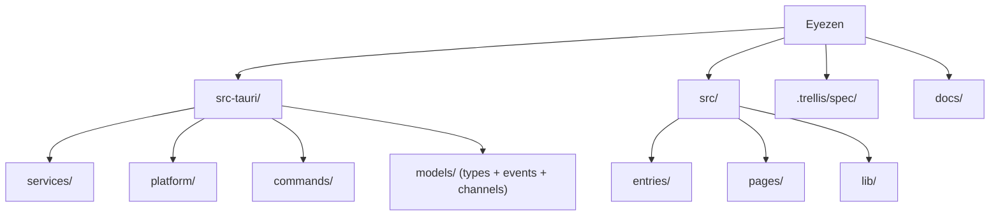

# Eyezen

基于 20-20-20 规则的跨平台桌面护眼工具。

- 开源 (GPL-3.0-or-later)，社区驱动
- 跨平台：Windows / macOS / Linux
- 面向技术用户（细粒度控制）和普通用户（开箱即用）

---

## 项目状态

**当前阶段：v0.2.0 已发布（2026-05-20），Phase 2 增强进行中。**

- Phase 1 MVP 代码已废弃，仅保留架构经验和设计决策
- 脚手架已就绪：Tauri v2 + Svelte 5 + Vite 6 + TailwindCSS v4
- 后端 MVP 已实现：7 个核心服务 + Commands + Events + Platform + Models
- 前端原型已实现：ts-rs 类型桥接 + IPC stores + tray-panel + tip-window + tip-minimal
- 手动测试通过：完整用户流程验证（Working → PreAlert → Alerting → Resting → Working）
- Settings UI + About 页面已实现（Plan 010）
- i18n 已实现：全栈 zh-CN/en 双语 + 热切换（Plan 011）
- 主题切换已实现：Dark/Light CSS 变量 + 原生标题栏适配（Plan 012）
- 开机自启动已实现：tauri-plugin-autostart 集成（Plan 013）
- CI/CD 已就绪：三平台 CI 矩阵 + 四目标 Release 构建（Plan 014）+ cargo-deny 安全审计
- v0.1.0 已发布（MIT）：2026-03-21，9 个 artifact，Draft published
- 工作日调度已实现：周几粒度按 Working→PreAlert 跳转点抑制弹窗，复用 SkipFlags
- License 切换：MIT → GPL-3.0-or-later，自 v0.2.0 起生效（v0.1.0 二进制永久保留 MIT）
- v0.2.0 已发布（GPL-3.0-or-later）：2026-05-20，10 个 artifact（多了 .rpm），latest published；含 weekday scheduling + 主窗 880×560 调整 + bump-version.mjs Cargo.lock 同步修复
- 下一步：Phase 2 继续（Statistics / 离席检测）

---

## 技术栈（版本锁定）

| 层 | 选型 | 版本约束 | 实际版本 | 说明 |
|---|------|---------|---------|------|
| 框架 | Tauri | v2 (`~2.x`) | `~2.10` | 跨平台，Rust 后端 |
| 前端 | Svelte 5 (Runes) | `~5.x` | `~5.54.0` | 零运行时编译 |
| 构建 | Vite | `~6.x` | `~6.4.1` | 快速 HMR |
| CSS | TailwindCSS | v4 (`~4.x`) | `~4.2.1` | 工具类优先 |
| 图表 | ECharts | tree-shaken | `~6.1.0` | Statistics 趋势图 |
| 自启动 | tauri-plugin-autostart | `~2.2` | `~2.2` | 开机自启 |
| 数据库 | SQLite | via sqlx | `~0.8.6` | 统计数据持久化 |
| 配置 | TOML | 人类可读 | `~0.8` | |
| 类型桥接 | ts-rs | 最新稳定 | `~10.1` (dev-dep) | Rust → TS |
| 日志 | tracing + 日轮转 | -- | `~0.1` / `~0.3` / `~0.2` | tracing + subscriber + appender |
| 音频 | rodio | 独立线程 | `~0.20` | |
| 序列化 | serde + serde_json | `~1.0` | `~1.0` | |
| 异步 | tokio | `~1.x` | `~1.50` (full) | |
| 测试 | Vitest | `~3.x` | `~3.2.4` | |
| 类型检查 | svelte-check | `~4.x` | `~4.4.5` | |

---

## 架构总览

```
Frontend (Svelte 5, per window)
  ├── invoke()  → Rust Commands (thin layer)
  └── listen()  ← Rust Events (typed emit)
                       │
                  AppServices (Arc, Tauri State)
                  ├── ConfigService    TOML 读写 + watch channel
                  ├── TimerService     纯函数状态机 + tokio timer
                  ├── DetectorService  全屏检测 (MVP)
                  ├── WindowService    多显示器 tip-window
                  ├── SoundService     rodio 独立线程
                  ├── TrayService      托盘菜单 + tooltip
                  ├── I18nService      语言切换 + 热切换
                  └── StatService      SQLite 统计
```

详细架构约束见 → [`.trellis/spec/architecture/layering.md`](.trellis/spec/architecture/layering.md) 与 [`.trellis/spec/backend/service-pattern.md`](.trellis/spec/backend/service-pattern.md)

---

## 模块结构



### 模块索引

| 模块 | 路径 | 状态 | 职责 |
|------|------|------|------|
| Rust 入口 | `src-tauri/src/main.rs`, `lib.rs` | 已实现 | Tauri Builder 启动 + 服务编排 |
| ConfigService | `src-tauri/src/services/config.rs` | 已实现 | TOML 配置读写 + arc-swap 热更新 |
| TimerService | `src-tauri/src/services/timer/` | 已实现 | 纯函数状态机 + tokio timer loop |
| DetectorService | `src-tauri/src/services/detector.rs` | 已实现 | 全屏检测 (平台委托) |
| WindowService | `src-tauri/src/services/window.rs` | 已实现 | 多显示器 tip-window 管理 |
| SoundService | `src-tauri/src/services/sound.rs` | 已实现 | rodio 独立线程 + mpsc |
| TrayService | `src-tauri/src/services/tray.rs` | 已实现 | 托盘菜单 + tooltip + i18n 热切换 |
| StatService | `src-tauri/src/services/stat.rs` | 已实现 | SQLite 统计持久化与趋势聚合 |
| I18nService | `src-tauri/src/services/i18n.rs` | 已实现 | zh-CN/en 双语 + 托盘翻译 |
| PlatformApi | `src-tauri/src/platform/` | 已实现 | 跨平台抽象 (Windows/macOS/Linux) |
| Commands | `src-tauri/src/commands/` | 已实现 | Tauri command 薄层 (10 个 commands) |
| Models | `src-tauri/src/models/` | 已实现 | 共享类型 + IPC events + 配置模型 |
| Error | `src-tauri/src/error.rs` | 已实现 | AppError + IPC 序列化 |
| Logging | `src-tauri/src/logging.rs` | 已实现 | tracing + 日志轮转 |
| ServiceContext | `src-tauri/src/services/context.rs` | 已实现 | 服务间通信上下文 |
| HTML 入口 | `*.html` (根目录) | 已存在 | Vite 多入口 |
| 前端 entries | `src/entries/` | 已存在 | 窗口 TS 入口 |
| 前端 pages | `src/pages/` | 已实现 | tray-panel / tip-window / tip-minimal / settings / about |
| 前端 lib | `src/lib/` | 已实现 | bindings / commands / events / stores / i18n |

---

## 分阶段交付

### MVP -- 核心可用

Timer 状态机、多显示器 tip-window、系统托盘、全屏 DND、基础配置、ts-rs 类型桥接、前端设置/tip/托盘/关于页

### Phase 2 -- 增强

离席检测、进程白名单、SQLite 统计 + ECharts、工作日调度

### Phase 3 -- 高级

健康分析、月度报告、番茄模式、数据导出、全局快捷键

---

## 开发命令

```bash
npm install                  # 安装依赖
npm run tauri dev            # 开发模式
npm run tauri build          # 生产构建
npm run format               # Prettier 格式化
npm run format:check         # Prettier 检查
cargo fmt --all --manifest-path src-tauri/Cargo.toml          # Rust 格式化
cargo clippy --manifest-path src-tauri/Cargo.toml --all-targets -- -D warnings  # Rust lint
cargo test --manifest-path src-tauri/Cargo.toml               # Rust 测试
npx svelte-check --tsconfig ./tsconfig.json                   # 前端类型检查
npm test                     # 前端测试
npm run build                # 前端构建检查
```

---

## 规则与约束（强制遵循）

> **所有开发 MUST 遵循 `.trellis/spec/` 下的规范文档。违反规则的代码不得合入。**
>
> 完整导航见各分组 `index.md`。

| 分组 | 索引 | 关键约束 |
|------|------|---------|
| 跨层架构 | [`.trellis/spec/architecture/`](.trellis/spec/architecture/index.md) | 分层依赖、IPC 契约、状态机、变更清单、测试质量、发版流程 |
| 后端 Rust | [`.trellis/spec/backend/`](.trellis/spec/backend/index.md) | 服务 DAG / 四阶段生命周期、错误传播、锁/异步、PlatformApi 降级、tracing 日志 |
| 前端 Svelte | [`.trellis/spec/frontend/`](.trellis/spec/frontend/index.md) | Svelte 5 Runes、单一数据源、ts-rs 桥接、CSP/capability、CSS 变量 |
| 思维指南 | [`.trellis/spec/guides/`](.trellis/spec/guides/index.md) | 跨层思考、代码复用思考（通用） |

### 关键文档速查

| 我在做… | 先看 |
|--------|------|
| 新增 Service | [`backend/service-pattern.md`](.trellis/spec/backend/service-pattern.md) |
| 新增 Tauri Command | [`architecture/ipc-and-state.md`](.trellis/spec/architecture/ipc-and-state.md) + [`architecture/change-management.md`](.trellis/spec/architecture/change-management.md) |
| 改 Timer 状态机 | [`architecture/ipc-and-state.md`](.trellis/spec/architecture/ipc-and-state.md) |
| Rust 错误/锁/异步 | [`backend/coding-standards.md`](.trellis/spec/backend/coding-standards.md) |
| 平台相关代码 | [`backend/platform-storage.md`](.trellis/spec/backend/platform-storage.md) |
| 新增前端页面/组件 | [`frontend/component-guidelines.md`](.trellis/spec/frontend/component-guidelines.md) + [`frontend/quality-guidelines.md`](.trellis/spec/frontend/quality-guidelines.md) |
| 改 store / IPC 调用 | [`frontend/store-and-ipc-patterns.md`](.trellis/spec/frontend/store-and-ipc-patterns.md) |
| 提交前自检 | [`architecture/testing-quality.md`](.trellis/spec/architecture/testing-quality.md) |
| 发版 | [`architecture/change-management.md`](.trellis/spec/architecture/change-management.md) + [`docs/workflows/release.md`](docs/workflows/release.md) |

---

## 文档索引

### 设计与规划

| 文档 | 路径 | 说明 |
|------|------|------|
| 重建设计规格 | `docs/.local/specs/2026-03-18-eyezen-rebuild-design.md` | 核心参考 |
| 前端原型设计规格 | `docs/.local/specs/2026-03-19-frontend-prototype-design.md` | tray-panel + tip-window 设计 |
| Settings/About 设计规格 | `docs/.local/specs/2026-03-20-main-window-settings-about-design.md` | Settings UI + About 页面 |
| i18n 设计规格 | `docs/.local/specs/2026-03-20-i18n-design.md` | 全栈 i18n 方案 |
| Theme/Autostart 设计规格 | `docs/.local/specs/2026-03-20-theme-autostart-design.md` | 主题切换 + 开机自启动 |
| 前端原型 mockup | `docs/.local/mockups/2026-03-19-tray-tip-v4.html` | 已采纳的 v4 视觉原型（浏览器打开） |
| 主题对比 mockup | `docs/.local/mockups/2026-03-20-theme-comparison.html` | Dark/Light 主题视觉对比 |
| 实现计划 | `docs/plans/` | 功能切片，命名 `<NNN>-<scope>.md` |
| 开发工作流（详细） | `docs/.local/dev-workflow.md` | 10 阶段全生命周期（本地参考） |

### 工作流与 CI

| 文档 | 路径 | 说明 |
|------|------|------|
| 开发工作流 | `docs/workflows/dev.md` | 日常开发循环 + Git Hooks 说明 |
| 发版工作流 | `docs/workflows/release.md` | Release rules, commands, and checks |
| Release 命名规范 | `docs/workflows/release-naming.md` | 制品命名约定 |
| PR 流程 | `docs/workflows/pr.md` | Pull Request 模板与流程 |
| 分支保护 | `docs/workflows/branch-protection.md` | GitHub Settings 配置（main 保护、auto-delete head） |
| 文档更新流程 | `docs/workflows/update-docs.md` | 文档同步工作流 |
| Agent 配置 | `AGENTS.md` | Claude / Codex / Trellis 配置导航 |
| CI 配置 | `.github/workflows/ci.yml` | 三平台 CI 矩阵 |
| Release CI | `.github/workflows/release.yml` | 四目标 Release 构建 |
| Release notes 模板 | `.github/release.yml` | GitHub 自动 release notes |

### 经验与调研

| 文档 | 路径 | 说明 |
|------|------|------|
| Phase 1 复盘 | `docs/.local/experience-review.md` | 保留/改变的决策 |
| 开发日志 | `docs/devlog.md` | 关键决策记录 |
| ProjectEye 调研 | `docs/.local/projecteye-research.md` | 竞品参考 |
| Blink Eye 调研 | `docs/.local/blinkeye-research.md` | 竞品参考 |
| UI 风格对比 | `docs/.local/style-comparison.html` | 视觉方向参考 |

---

## AI 使用指引

### 实现顺序（固定，不可跳步）

1. 读现有代码，理解模式
2. 列出影响面（参照 [`architecture/change-management.md`](.trellis/spec/architecture/change-management.md) 的变更清单）
3. 先定接口，再填实现
4. 写实现代码
5. 写对应测试
6. 跑自动检查
7. 更新文档（如有 API 变更）

### AI 输出必须附带

```
Assumptions:       假设了什么
Docs checked:      查了哪些文档
Files touched:     改了哪些文件
Tests to run:      需要跑哪些测试
Open risks:        已知风险
```

### 会话管理

满足任一条件开新会话：
- 改动超过 8 个文件或跨 3 个以上模块
- 会话超过 1 个主要功能
- AI 开始重复忘记前提
- 上下文窗口已压缩

---

## 关键决策

- License: GPL-3.0-or-later from the next release after v0.1.0; v0.1.0 artifacts remain MIT.
- Workflow: all changes to `main` go through PR; no direct release merges.
- Specs: canonical rules live in `.trellis/spec/`; do not duplicate them in root docs.
- CI: local and cloud checks share `npm run ci`; release packaging runs only on `v*` tags.
- Frontend: Vite multi-entry HTML files stay at repo root unless all Tauri URLs and Vite inputs are migrated together.

History lives in `CHANGELOG.md` and `docs/devlog.md`.
