# Eyezen

基于 20-20-20 规则的跨平台桌面护眼工具。每隔可配置间隔提醒用户休息眼睛，追踪使用统计，提供眼部健康洞察。

- 开源 (MIT)，社区驱动，无商业功能
- 面向技术用户（细粒度控制）和普通用户（开箱即用默认值）
- 跨平台：Windows / macOS / Linux

---

## 项目状态

**当前阶段：重建 -- 脚手架已初始化，准备进入后端服务实现。**

- Phase 1 MVP 已完成并经三模型审查（Claude Opus + Codex + Gemini）
- Phase 1 代码已废弃，仅保留架构经验和设计决策
- 重建设计规格：`docs/superpowers/specs/2026-03-18-eyezen-rebuild-design.md`
- 脚手架已就绪：Tauri v2 + Svelte 5 + Vite 6 + TailwindCSS v4
- 下一步：规划后端切片（ConfigService → TimerService → ...），同步做前端原型

---

## 技术栈（版本锁定）

| 层 | 选型 | 版本约束 | 说明 |
|---|------|---------|------|
| 框架 | Tauri | v2 (`~2.x`) | 跨平台，轻量，Rust 后端 |
| 前端 | Svelte 5 (Runes) | `~5.x` | 零运行时编译，最小 bundle |
| 构建 | Vite | `~6.x` | Tauri 官方推荐，快速 HMR |
| CSS | TailwindCSS | v4 (`~4.x`) | 工具类优先，与 Svelte 配合好 |
| 图表 | ECharts | tree-shaken 导入 | 功能全面，CJK 生态好 |
| 数据库 | SQLite | 通过 Rust sqlx | 后端管理，单文件 |
| 配置 | TOML | 人类可读 | Rust 生态标准 |
| 类型桥接 | ts-rs | 最新稳定版 | Rust struct -> TS type 生成 |
| 日志 | tracing + 每日轮转 | -- | Phase 1 已验证 |
| 音频 | rodio (独立线程) | -- | Phase 1 已验证 |

**依赖管理规则**：
- 不允许 AI 随意引入新依赖，必须先讨论
- 版本锁定策略：次要版本号锁定（如 `"@tauri-apps/api": "~2.0.0"`）
- Rust 侧 `u32` 替代 `u64` 用于计时器场景，避免 ts-rs 生成 `bigint`

---

## 架构总览

```
Frontend (Svelte 5, per window)
  |-- invoke()  --> Rust Commands (thin layer)
  +-- listen()  <-- Rust Events (typed emit)
                       |
                  AppServices (Arc, Tauri State)
                  |-- ConfigService    TOML 读写 + watch channel 广播 + 原子写入
                  |-- TimerService     纯函数状态机 + tokio timer loop + 锁外执行 effects
                  |-- DetectorService  全屏检测 (MVP); 离席检测 + 进程白名单 (P2)
                  |-- WindowService    多显示器 tip-window 生命周期管理
                  |-- StatService      SQLite 存储 + 查询 API (P2)
                  |-- SoundService     rodio 独立线程 + mpsc channel
                  |-- TrayService      托盘菜单 + tooltip 倒计时 + 状态图标
                  +-- I18nService      语言目录 + 语言切换 (P2)
```

### 服务注册

显式 struct，无 IoC/反射：

```rust
pub struct AppServices {
    pub config: ConfigService,
    pub timer: TimerService,
    pub detector: DetectorService,
    pub window: WindowService,
    pub stat: StatService,
    pub sound: SoundService,
    pub tray: TrayService,
    pub i18n: I18nService,
}
```

- `setup()` 中显式初始化顺序，所有 `init()` 在 `Arc` 包装之前完成
- 包装后 `tauri::State<Arc<AppServices>>`（不可变共享引用）
- 每个服务管理自己的内部可变性（如 `TimerService` 持有 `Mutex<Inner>`）

### 服务间通信

类型化 channel，无中心事件总线：

```
ConfigService  --watch channel-->  TimerService, TrayService, SoundService, ...
TimerService   --broadcast-->      WindowService, TrayService, StatService
DetectorService --mpsc-->          TimerService
```

### 优雅关闭

hook `RunEvent::ExitRequested`，按依赖安全逆序关闭：
1. 停止事件源：TrayService -> TimerService -> DetectorService
2. 停止效果执行器：WindowService -> SoundService
3. 停止基础设施：StatService -> ConfigService

---

## 模块结构图

```mermaid
graph TD
    ROOT["Eyezen (根)"] --> SRC_TAURI["src-tauri (Rust 后端)"]
    ROOT --> SRC["src (Svelte 前端)"]
    ROOT --> DOCS["docs"]

    SRC_TAURI --> SERVICES["services/"]
    SERVICES --> S_CONFIG["ConfigService"]
    SERVICES --> S_TIMER["TimerService"]
    SERVICES --> S_DETECTOR["DetectorService"]
    SERVICES --> S_WINDOW["WindowService"]
    SERVICES --> S_STAT["StatService (P2)"]
    SERVICES --> S_SOUND["SoundService"]
    SERVICES --> S_TRAY["TrayService"]
    SERVICES --> S_I18N["I18nService (P2)"]

    SRC_TAURI --> PLATFORM["platform/"]
    PLATFORM --> P_WIN["windows.rs"]
    PLATFORM --> P_MAC["macos.rs"]
    PLATFORM --> P_LINUX["linux.rs"]

    SRC_TAURI --> COMMANDS["commands/"]
    SRC_TAURI --> EVENTS["events/"]

    SRC --> ENTRIES["entries/"]
    ENTRIES --> E_MAIN["main.html/ts"]
    ENTRIES --> E_TIP["tip.html/ts"]
    ENTRIES --> E_TIPMIN["tip-minimal.html/ts"]
    ENTRIES --> E_TRAY["tray.html/ts"]

    SRC --> PAGES["pages/"]
    PAGES --> PG_MAIN["main/ (Settings|Statistics|About)"]
    PAGES --> PG_TIP["tip/ (TipApp)"]
    PAGES --> PG_TIPMIN["tip-minimal/ (TipMinimalApp)"]
    PAGES --> PG_TRAY["tray/ (TrayApp)"]

    SRC --> LIB["lib/"]
    LIB --> L_BIND["bindings/ (ts-rs 生成)"]
    LIB --> L_CMD["commands.ts"]
    LIB --> L_EVT["events.ts"]
    LIB --> L_STORE["stores/"]
    LIB --> L_COMP["components/"]
```



---

## 模块索引

| 模块 | 路径 (计划) | 语言 | 职责 | 阶段 |
|------|------------|------|------|------|
| ConfigService | `src-tauri/src/services/config.rs` | Rust | TOML 配置读写、watch channel 广播、原子写入 | MVP |
| TimerService | `src-tauri/src/services/timer.rs` | Rust | 纯函数状态机、tokio timer loop、锁外 effects | MVP |
| DetectorService | `src-tauri/src/services/detector.rs` | Rust | 全屏检测 (MVP)；离席检测 + 进程白名单 (P2) | MVP |
| WindowService | `src-tauri/src/services/window.rs` | Rust | 多显示器 tip-window 创建/销毁 | MVP |
| SoundService | `src-tauri/src/services/sound.rs` | Rust | rodio 独立线程 + mpsc channel 音频播放 | MVP |
| TrayService | `src-tauri/src/services/tray.rs` | Rust | 托盘菜单、tooltip 倒计时、状态图标切换 | MVP |
| StatService | `src-tauri/src/services/stat.rs` | Rust | SQLite 存储 + 查询 API | P2 |
| I18nService | `src-tauri/src/services/i18n.rs` | Rust | 语言目录 + 运行时语言切换 | P2 |
| PlatformApi | `src-tauri/src/platform/` | Rust | 跨平台抽象 trait + 平台实现 | MVP |
| Commands | `src-tauri/src/commands/` | Rust | Tauri command 薄层 | MVP |
| Events | `src-tauri/src/events/` | Rust | Tauri 类型化事件定义 | MVP |
| 前端 entries | `src/entries/` | TS/Svelte | Vite 多入口 (main/tip/tip-minimal/tray) | MVP |
| 前端 pages | `src/pages/` | Svelte | 各窗口页面组件 | MVP |
| 前端 lib | `src/lib/` | TS/Svelte | 共享组件、bindings、stores、commands/events 封装 | MVP |

---

## Timer 状态机

### 状态

```
Working     -- 工作计时中
PreAlert    -- 预提醒：托盘 tooltip 变化 + 可选预提醒音效
Alerting    -- 全屏提醒显示，等待用户操作（超时自动消失）
Resting     -- 用户选择休息，倒计时中
Paused      -- 用户手动暂停
Away        -- 离席检测触发 (P2)
```

### 状态转换

```
start --> Working
Working --timeout--> PreAlert
PreAlert --timeout--> Alerting
Alerting --user:start_rest--> Resting
Alerting --user:skip--> Working
Alerting --timeout(alert_timeout_seconds)--> Working (自动消失，计为 skip)
Resting --timeout--> Working
Any(except Away) --user:pause--> Paused
Paused --user:resume--> Working
Working --detector:away--> Away (P2)
Away --detector:back--> Working (P2)
```

### 核心三函数

```rust
// 纯函数：用户事件 -> 状态转换
fn resolve_user_event(state: &TimerState, event: UserEvent) -> Option<Transition>;

// 纯函数：时间推进 -> 状态转换
fn step_time(inner: &Inner, now: Instant, skip_flags: &SkipFlags) -> Option<Transition>;

// 收集副作用（锁内收集，锁外执行）
fn collect_effects(transition: &Transition, inner: &Inner) -> Vec<Effect>;
```

### Effect 类型

```rust
pub enum Effect {
    EmitStateChanged(StatePayload),
    ShowTipWindows,
    HideTipWindows,
    PlaySound(SoundType),
    UpdateTray(TrayUpdate),
    RecordStat(StatEvent),       // P2
    ResetWorkTimer(Duration),
}
```

### SkipFlags

```rust
pub struct SkipFlags {
    pub fullscreen_active: bool,      // MVP
    pub whitelisted_process: bool,    // P2
    pub user_away: bool,              // P2
    pub outside_workday: bool,        // P2
}
```

Working 超时时，如果任何 flag 为 true -> 重置计时器，不进入 PreAlert。

---

## IPC 接口定义

### Commands (Frontend -> Backend)

| Command | 参数 | 返回 | 窗口权限 | 说明 |
|---------|------|------|---------|------|
| `get_state_snapshot` | -- | `StatePayload` | all | 获取当前状态快照 |
| `start_rest` | -- | `()` | tip, tray | 开始休息 |
| `skip_rest` | -- | `()` | tip, tray | 跳过休息 |
| `pause_timer` | -- | `()` | tray, main | 暂停计时器 |
| `resume_timer` | -- | `()` | tray, main | 恢复计时器 |
| `get_config` | -- | `Config` | main | 获取完整配置 |
| `update_timer_config` | `TimerConfig` | `()` | main | 更新计时器配置 (下周期生效) |
| `update_behavior_config` | `BehaviorConfig` | `()` | main | 更新行为配置 (即时生效) |
| `update_display_config` | `DisplayConfig` | `()` | main | 更新显示配置 (即时生效) |
| `get_daily_stats` | `{ range }` | `Vec<DailyStat>` | main | P2: 查询每日统计 |

### Events (Backend -> Frontend)

| Event | Payload | 说明 |
|-------|---------|------|
| `state_changed` | `StatePayload` | 状态变更通知 |
| `config_changed` | `Config` | 配置变更通知 |

### 错误类型

```rust
#[derive(Debug, Serialize)]
#[serde(tag = "kind", content = "detail")]
pub enum AppError {
    ConfigInvalid { field: String, reason: String },
    ServiceNotReady { service: String },
    IoError { message: String },
}
```

### 通信模式

```
初始化: listen() 先注册 -> invoke('get_state_snapshot') 拉取当前状态
运行时: listen('state_changed') 接收后端推送
操作:  invoke('start_rest') / invoke('skip_rest') / invoke('update_timer_config', {...})
```

前端不直接访问 SQLite、文件系统或系统 API。

---

## 前端架构

### Vite 多入口（非 SvelteKit）

纯 Svelte 5 + Vite，每个窗口类型一个 HTML 入口，避免轻量窗口加载不必要代码。

```
src/
|-- entries/
|   |-- main.html / main.ts       -> main-window
|   |-- tip.html / tip.ts         -> tip-window-{n}
|   |-- tip-minimal.html / tip-minimal.ts -> tip-window-minimal-{n}
|   +-- tray.html / tray.ts       -> tray-panel
|-- pages/
|   |-- main/
|   |   |-- MainApp.svelte        Tab 布局 (Settings | Statistics | About)
|   |   |-- Settings.svelte
|   |   |-- Statistics.svelte     P2
|   |   +-- About.svelte
|   |-- tip/
|   |   +-- TipApp.svelte         主显示器提醒
|   |-- tip-minimal/
|   |   +-- TipMinimalApp.svelte  副显示器遮罩
|   +-- tray/
|       +-- TrayApp.svelte        托盘快捷面板
|-- lib/
|   |-- components/               共享组件
|   |-- bindings/                 ts-rs 生成类型（直接消费）
|   |-- events.ts                 Tauri 事件监听封装
|   |-- commands.ts               Tauri invoke 封装
|   +-- stores/                   Svelte stores
+-- app.css                       TailwindCSS + CSS 变量
```

### 窗口

| 窗口 | 用途 | 生命周期 | 阶段 |
|------|------|---------|------|
| `main-window` | 设置/统计/关于 (Tab 切换) | 用户按需打开，关闭时隐藏 | MVP |
| `tip-window-{n}` | 全屏休息提醒 (每个显示器一个) | Alerting/Resting 时创建，结束后销毁 | MVP |
| `tip-window-minimal-{n}` | 副显示器最小化遮罩 | 同上，仅副显示器 | MVP |
| `tray-panel` | 托盘点击快捷面板 | tauri.conf.json 预创建隐藏，托盘左键点击时切换 | MVP |

### Capability 权限 (最小权限原则)

```
capabilities/
|-- main-window.json       window:*, config:*, stat:*
|-- tip-window.json        timer:start_rest, timer:skip_rest
|-- tray-panel.json        timer:*, config:get
+-- default.json           shared: event listeners
```

### 视觉设计体系

风格方向：Linear/Raycast 现代质感 + macOS 暖色干净 light 风格

```css
:root {
  --bg-primary: #fafbfc;
  --bg-secondary: #f0f2f5;
  --bg-card: #ffffff;
  --text-primary: #1a1d23;
  --text-secondary: #6b7280;
  --accent: #6366f1;
  --accent-soft: rgba(99, 102, 241, 0.08);
  --green: #22c55e;
  --border: #e5e7eb;
  --shadow-sm: 0 1px 2px rgba(0, 0, 0, 0.04);
  --shadow-md: 0 4px 12px rgba(0, 0, 0, 0.06);
  --radius-sm: 8px;
  --radius-md: 12px;
  --radius-lg: 16px;
  --transition: 150ms ease;
}
```

---

## 数据与存储

### 存储策略

| 数据 | 存储 | 格式 | 位置 |
|------|------|------|------|
| 用户配置 | 单文件 | TOML | `config_dir/eyezen/config.toml` |
| 统计数据 | 单数据库 | SQLite | `app_data_dir/eyezen/data.db` |
| 日志 | 日志文件 | text | `app_data_dir/eyezen/logs/` |

### 配置结构

```toml
[timer]
work_minutes = 20
rest_seconds = 20
pre_alert_seconds = 15
alert_timeout_seconds = 60

[behavior]
sound_enabled = true
fullscreen_skip = true
auto_start = false

[display]
language = "zh-CN"           # P2
theme = "light"              # MVP: light only; P2: dark + system-auto
```

### ConfigService 设计

```rust
pub struct ConfigService {
    config: Arc<ArcSwap<Config>>,     // 无锁读取
    tx: watch::Sender<Arc<Config>>,   // 变更广播
    path: PathBuf,
}
```

- 读取：任意线程，通过 `ArcSwap` 无锁（用于 Tauri command 只需当前值的场景）
- 订阅：需要响应变更的服务在 init 时获取 `watch::Receiver`
- 更新：section 级 command（非逐字段字符串匹配）
- 写入：原子操作（tmp 文件 + rename）
- 解析失败：保留 `.bak` 备份，不覆盖为默认值

### 配置更新语义

| 配置项 | 生效时机 | 说明 |
|--------|---------|------|
| `sound_enabled`, `fullscreen_skip` | 即时 | 下次 tick 读取新值 |
| `work_minutes`, `rest_seconds`, `pre_alert_seconds` | 下周期 | 当前周期不中断 |
| `language`, `theme` | 即时 | 前端监听变更事件，重新渲染 |
| `shortcuts` | 重启 | 全局热键启动时注册 |

### SQLite Schema (P2)

```sql
CREATE TABLE activity_segments (
    id INTEGER PRIMARY KEY AUTOINCREMENT,
    state TEXT NOT NULL,          -- 'working', 'resting', 'away', 'paused'
    started_at TEXT NOT NULL,     -- ISO 8601
    ended_at TEXT NOT NULL,
    date TEXT NOT NULL            -- YYYY-MM-DD
);
```

---

## 平台抽象

### PlatformApi Trait

```rust
pub trait PlatformApi: Send + Sync {
    fn is_fullscreen_app_active(&self) -> bool;              // MVP
    fn get_cursor_position(&self) -> Option<(i32, i32)>;     // P2
    fn get_system_audio_peak(&self) -> Option<f32>;          // P2
    fn get_foreground_process_name(&self) -> Option<String>; // P2
}
```

### 平台能力矩阵

| 能力 | Windows | macOS | Linux X11 | Linux Wayland |
|------|---------|-------|-----------|---------------|
| 全屏检测 | `GetForegroundWindow` + `MonitorFromWindow` | `CGWindowListCopyWindowInfo` | `_NET_WM_STATE_FULLSCREEN` | 降级: false |
| 光标位置 | `GetCursorPos` | `CGEventSource` | `XQueryPointer` | 有限 |
| 系统音频 | `IAudioMeterInformation` COM | 降级: 无公共 API | PulseAudio peak | PulseAudio peak |
| 前台进程 | `GetWindowThreadProcessId` | `NSWorkspace` | `_NET_ACTIVE_WINDOW` + `/proc` | 降级: None |

### 降级原则

- 每个能力只告警一次，不刷日志
- 保守降级：宁可多提醒，不漏提醒
- 在设置 UI 中展示降级信息："部分功能在 Wayland 上不可用"

---

## 开发命令

> 注意：脚手架尚未初始化，以下为项目初始化后的预期命令。

```bash
# 安装依赖
npm install

# 开发模式（Tauri + Vite HMR）
npm run tauri dev

# 构建生产版本
npm run tauri build

# Rust 格式化
cargo fmt --all --manifest-path src-tauri/Cargo.toml

# Rust lint
cargo clippy --manifest-path src-tauri/Cargo.toml --all-targets -- -D warnings

# Rust 测试
cargo test --manifest-path src-tauri/Cargo.toml

# 前端类型检查
npx svelte-check --tsconfig ./tsconfig.json

# 前端测试
npm test

# 前端构建检查
npm run build

# ts-rs 类型生成
cargo test --manifest-path src-tauri/Cargo.toml export_bindings

# 安全审计
cargo audit --manifest-path src-tauri/Cargo.toml
cargo deny check --manifest-path src-tauri/Cargo.toml
```

### Rust Lint 配置

在 `lib.rs` 或 `main.rs` 顶部：

```rust
#![deny(clippy::all)]
#![warn(clippy::pedantic)]
```

---

## 测试策略

| 层级 | 工具 | 覆盖范围 |
|------|------|---------|
| Rust 单元测试 | `cargo test` | 状态机、配置、服务 |
| Rust 集成测试 | `cargo test --test` | 存储层、跨服务交互 |
| 前端组件测试 | Vitest + Testing Library | 组件渲染、交互、Store |
| 前端类型检查 | `svelte-check` | 类型安全、Svelte 结构 |
| E2E 测试 | Tauri Driver（后期） | 完整用户流程 |

| 变更类型 | 测试要求 |
|----------|---------|
| `fix` | 先写失败测试，再修复 |
| `feat` -- Rust 服务/状态机 | 单元测试覆盖关键状态转换、边界值、错误路径 |
| `feat` -- Tauri command | 至少一条边界测试 |
| `feat` -- Svelte 组件（有交互/分支） | 组件测试 |
| 纯样式/文案/文档 | 必须过构建 |
| `refactor` | 现有测试全部通过 |

---

## 编码规范

### Rust

- 错误处理：不使用 `unwrap()`，全部返回 `Result`
- 锁策略：reducer 模式 -- 锁内收集 effects，锁外执行
- 异步：不在 async 上下文中做同步 I/O，用 `spawn_blocking`
- 命令层：薄封装，业务逻辑在 service 层
- 类型导出：所有前端需要的类型通过 ts-rs 导出，使用 `u32` 而非 `u64`
- 配置更新：section 级 command，不做逐字段字符串匹配
- Lint：`#![deny(clippy::all)]` + `#![warn(clippy::pedantic)]`

### Svelte 5 (Runes)

- 使用 `$state`/`$derived`/`$effect`/`$props` Runes 语法
- 不使用 Svelte 4 的 `$:` 语法和 `let` 响应式声明
- 组件职责单一，不超过 200 行
- 类型从 `$lib/bindings/` 直接导入 ts-rs 生成类型
- 事件处理使用 Svelte 5 的事件系统

### 通用

- 注释只描述意图、约束和设计理由，不复述代码
- 提交遵循 Conventional Commits
- 分支命名：`feat/xxx`, `fix/xxx`, `refactor/xxx`, `docs/xxx`
- 文件编码：UTF-8 (无 BOM)，行尾：LF

---

## 质量门禁

### Pre-commit（<15 秒）

```bash
cargo fmt --all --check --manifest-path src-tauri/Cargo.toml
```

### Pre-push（全量）

```bash
cargo clippy --manifest-path src-tauri/Cargo.toml --all-targets -- -D warnings
cargo test --manifest-path src-tauri/Cargo.toml
npx svelte-check --tsconfig ./tsconfig.json
npm test
npm run build
```

### CI (GitHub Actions)

在 `push`/`pull_request` 到 `dev`/`main` 时触发，覆盖 Rust fmt + clippy + test + svelte-check + frontend test + build + security audit。

---

## 分阶段交付

### MVP -- 核心可用产品

- Timer 状态机 (Working -> PreAlert -> Alerting -> Resting -> Working)
- 多显示器全屏 tip-window (主屏完整 + 副屏最小化)
- 系统托盘 (倒计时 tooltip + 基础菜单)
- 全屏应用 DND (三平台)
- 基础配置 + 原子写入 + watch channel 广播
- DetectorService (仅全屏检测)
- 优雅关闭
- ts-rs 类型桥接
- 前端：设置页、tip 窗口、托盘面板、关于页
- 视觉：现代质感 + 干净 light 主题

### Phase 2 -- 核心增强

- 离席检测 (Win 双因子, Mac/Linux 降级)
- 进程白名单
- SQLite 统计 + ECharts 图表 (日/周)
- i18n (zh-CN / en)
- 工作日调度
- 统计页面

### Phase 3 -- 高级功能

- 眼部健康分析 + 改善建议
- 月度报告
- 番茄模式
- Tip 窗口主题系统
- 数据导出
- 全局快捷键

---

## AI 使用指引

### 实现顺序（固定，不可跳步）

1. 读现有代码，理解模式
2. 列出影响面
3. 先定接口，再填实现
4. 写实现代码
5. 写对应测试
6. 跑自动检查
7. 更新文档（如有 API 变更）

### AI 输出必须附带

```
Assumptions:       假设了什么
Docs checked:      查了哪些文档
Files touched:     改了哪些文件
Tests to run:      需要跑哪些测试
Open risks:        已知风险
```

### Skill 链式调用

```
新增 Tauri 功能:    tauri-v2 -> configuring-tauri-permissions -> rust-async-patterns -> rust-best-practices
新增 Svelte 页面:   svelte-code-writer -> svelte5-best-practices -> 组件测试 review
跨边界功能:         后端链一遍 -> 前端链一遍 -> 多模型 review
```

### 多模型分工

| 模型 | 角色 | 用途 |
|------|------|------|
| Claude Code | 主实现器 | 长链路实现、小步迭代 |
| Codex | 代码级审查器 | 阻塞问题、缺失测试、回归点 |
| Gemini | 需求/边界审查器 | 用户场景覆盖、状态转换遗漏、异常路径 |

### 会话管理

满足任一条件开新会话：
- 改动超过 8 个文件或跨 3 个以上模块
- 会话超过 1 个主要功能
- AI 开始重复忘记前提
- 上下文窗口已压缩

---

## 关键文档索引

| 文档 | 路径 | 说明 |
|------|------|------|
| 重建设计规格 | `docs/superpowers/specs/2026-03-18-eyezen-rebuild-design.md` | 核心参考，已通过审查 |
| 开发工作流 | `docs/development-workflow.md` | 10 阶段全生命周期指南 |
| Phase 1 复盘 | `docs/.local/experience-review.md` | 保留/改变的设计决策 |
| 开发日志 | `docs/.local/devlog.md` | 关键决策、里程碑记录 |
| ProjectEye 调研 | `docs/.local/projecteye-research.md` | 竞品参考 |
| Blink Eye 调研 | `docs/.local/blinkeye-research.md` | 竞品参考 |
| UI 风格对比 | `docs/.local/style-comparison.html` | 视觉方向参考 |

---

## 变更记录 (Changelog)

### 2026-03-18 -- 脚手架初始化

- 初始化 Tauri v2 + Svelte 5 + Vite 6 + TailwindCSS v4 项目骨架
- 配置 Vite 多入口（main / tip / tip-minimal / tray）
- 创建 4 个窗口占位组件 + CSS 变量体系
- Rust 端 Builder + clippy lint + 占位 command
- 依赖版本 tilde 锁定，通过双轮代码审查（Claude + Codex）
- 更新项目状态

### 2026-03-18 -- 初始创建

- 基于重建设计规格生成根级 `CLAUDE.md`
- 覆盖：项目概述、架构、模块索引、IPC 接口、Timer 状态机、前端架构、数据存储、平台抽象、开发命令、编码规范、AI 使用指引
