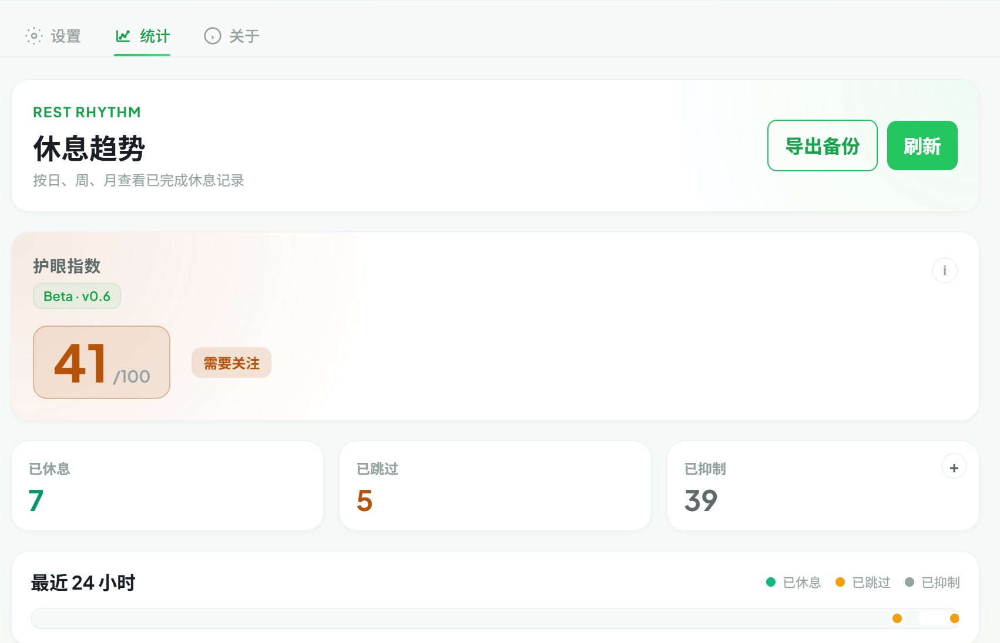
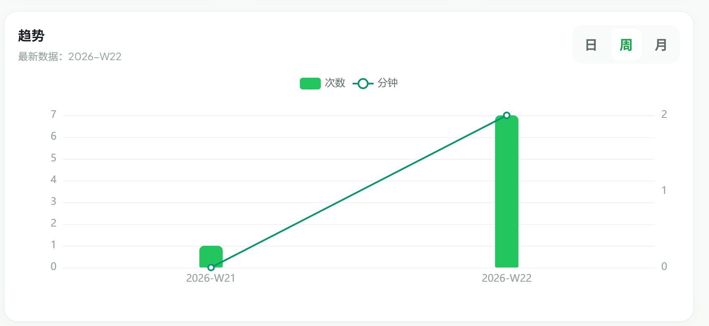
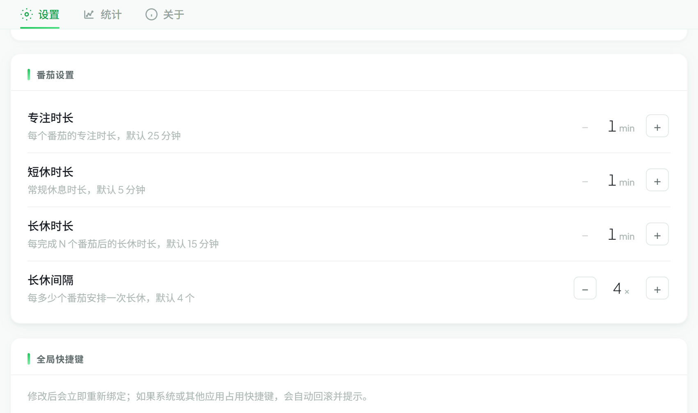

<p align="center">
  
</p>

<h1 align="center">Eyezen</h1>

<p align="center">
  <strong>Cross-platform desktop eye care app — quiet, smart, out of your way</strong>
</p>

<p align="center">
  <a href="LICENSE"></a>
  
  
  
  
</p>

<p align="center">
  English | <a href=".github/README.zh-CN.md">简体中文</a>
</p>

---

## 👀 Introduction

Eyezen is a lightweight desktop companion that protects your eyes without breaking your flow. It applies the **20-20-20 rule** — every 20 minutes look ~6 m away for 20 seconds — and offers a Pomodoro alternative for deep-work sessions. Smart skipping during fullscreen apps, AFK periods, or whitelisted processes keeps reminders unobtrusive; built-in statistics and health analysis show whether the habit is actually sticking.

## ✨ Highlights

- ⏱️ **Dual timer modes** — 20-20-20 or Pomodoro, both fully configurable
- 🎯 **Smart skipping** — fullscreen detection, AFK idle, process whitelist, weekday schedule
- 📊 **Statistics & Health Analysis** — daily / weekly / monthly ECharts trends and an Eye-Care Index that quantifies the habit
- 🖥️ **Multi-monitor reminders** — break overlay on every connected display
- 🌓 **Dark / Light + i18n** — Simplified Chinese / English hot switching, native title-bar adaptation on Windows
- ⌨️ **Global hotkeys & glassmorphic tray** — start / skip / pause via shortcut; tray panel follows the icon, auto-hides on blur
- ⚡ **Lightweight & tested** — ~15 MB RAM via Rust + Tauri; 90%+ coverage on both frontend and backend, enforced in CI

## 📸 Screenshots

### Core Experience

| Resting | Tip Window |
|:---:|:---:|
|  |  |

| Settings | About |
|:---:|:---:|
|  |  |

### Statistics & Health Analysis

| Overview · Eye-Care Index · 24h Ribbon | Daily / Weekly / Monthly Trend |
|:---:|:---:|
|  |  |

### Pomodoro Mode

<p align="center">
  
  <br/>
  <em>Configurable focus / short break / long break cycle alongside 20-20-20</em>
</p>

## 🚀 Quick Start

**Requirements**: [Node.js](https://nodejs.org/) v18+, [Rust](https://www.rust-lang.org/) (stable), platform-specific dependencies per [Tauri v2 Prerequisites](https://v2.tauri.app/start/prerequisites/).

```bash
git clone https://github.com/rsecss/eye-zen.git
cd eye-zen
npm install
npm run tauri dev    # Development mode (hot reload)
npm run tauri build  # Production build → src-tauri/target/release/bundle/
```

Run all 8 local CI checks (fmt, clippy, cargo test, svelte-check, vitest, prettier, build, version sync) in one shot:

```bash
npm run ci
```

## 🛠️ Tech Stack

| Layer | Choice | Description |
|-------|--------|-------------|
| Framework | [Tauri v2](https://v2.tauri.app/) | Rust backend + native WebView |
| Frontend | [Svelte 5](https://svelte.dev/) | Runes reactivity, zero runtime |
| Build | [Vite 6](https://vite.dev/) | Fast HMR, multi-entry windows |
| Styling | [TailwindCSS v4](https://tailwindcss.com/) | Utility-first |
| Charts | [ECharts](https://echarts.apache.org/) | Tree-shaken, lazy-loaded |
| Database | SQLite via [sqlx](https://github.com/launchbadge/sqlx) | Statistics persistence |
| Config | TOML | Human-readable |
| Audio | rodio | Rust-native, dedicated thread |
| Type Bridge | ts-rs | Rust → TypeScript auto-generation |

## 🏗️ Architecture

```
┌────────────────────────────────────────────────────────────┐
│  Frontend (Svelte 5)                                       │
│  Windows: main · tray-panel · tip-window · tip-minimal     │
│    invoke()  ─→ Tauri Commands (thin layer)                │
│    listen()  ←─ Typed Events (ts-rs bindings)              │
└────────────────────────────────────────────────────────────┘
                              │
┌────────────────────────────────────────────────────────────┐
│  Backend Services (Tauri State · 9 Arc-shared services)    │
│    Config · Timer · Detector · Window · Sound              │
│    Tray   · I18n  · Stat     · Hotkey                      │
│  Communication: watch channels + EffectSink trait          │
└────────────────────────────────────────────────────────────┘
                              │
┌────────────────────────────────────────────────────────────┐
│  Platform Layer — PlatformApi trait                        │
│  Windows · macOS · Linux X11/Wayland                       │
│  Capabilities: fullscreen detect · idle · foreground proc  │
└────────────────────────────────────────────────────────────┘
```

- **Services** are constructed once at startup and shared via `Arc<AppServices>` Tauri state; they communicate through typed `tokio::sync::watch` channels and an `EffectSink` trait so the timer state machine stays pure.
- **Platform abstraction** isolates OS-specific FFI behind the `PlatformApi` trait with per-capability degrade flags — the Settings UI greys out toggles whose capability is unavailable (e.g. AFK on Wayland).
- **IPC contracts** are auto-generated by `ts-rs` and centralized in `src/lib/bindings/`, eliminating a class of Rust↔TS drift bugs.
- **Coding rules** under `.trellis/spec/` are the canonical source for layering, IPC, and platform conventions — read them before contributing.

## ⚙️ Configuration

Config is stored as `config.toml` in the system app data directory; the statistics database `data.db` lives alongside it.

| Platform | Path |
|----------|------|
| Windows | `%APPDATA%\com.eyezen.app\` |
| macOS | `~/Library/Application Support/com.eyezen.app/` |
| Linux | `~/.config/com.eyezen.app/` |

All settings can be modified through the in-app Settings UI — you should never have to edit the TOML by hand.

## 🤝 Contributing

Contributions are welcome! Please read [CONTRIBUTING.md](.github/CONTRIBUTING.md) for guidelines.

## 📄 License

[GNU General Public License v3.0 or later](LICENSE)
