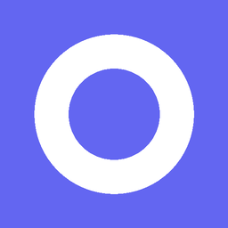

<p align="center">
  
</p>

<h1 align="center">Eyezen</h1>

<p align="center">
  <strong>Cross-platform desktop eye care app based on the 20-20-20 rule</strong>
</p>

<p align="center">
  <a href="LICENSE"></a>
  
  
  
</p>

<p align="center">
  English | <a href="README.zh-CN.md">简体中文</a>
</p>

> **Status**: v0.1.0 in development. Pre-built installers are not yet available — please [build from source](#build-from-source) for now.

---

## What is the 20-20-20 Rule?

Every **20** minutes, look at something **20** feet (~6 meters) away for **20** seconds. This simple habit effectively reduces eye strain caused by prolonged screen time.

Eyezen automates this process — it quietly runs in the background and gently reminds you to rest when it's time.

## Features

- **20-20-20 Timer** — Customizable work/rest durations with full state machine (Working → PreAlert → Alerting → Resting)
- **Multi-monitor Support** — Break reminder windows appear on all connected displays
- **Fullscreen Detection** — Auto-skip reminders during fullscreen apps (Windows / Linux X11; limited on macOS & Wayland)
- **System Tray** — Persistent tray icon with status, quick actions, and glassmorphic panel
- **Dark / Light Theme** — Follows your preference including native title bar
- **Auto Start** — Launch at system startup
- **i18n** — Chinese / English with hot switching
- **Sound Alerts** — Gentle audio cue on break reminders
- **Lightweight** — Rust backend + native WebView via Tauri, minimal resource usage

## Screenshots

> Screenshots coming soon. PRs welcome!

<!-- TODO: Add screenshots


-->

## Download

### Release Artifacts

> Pre-built installers will be available after the first release.

| Platform | Installer | Portable |
|----------|-----------|----------|
| Windows x64 | `Eyezen_{ver}_x64-setup.exe` / `.msi` | `Eyezen_{ver}_x64-portable.zip` |
| macOS ARM (M1+) | `Eyezen_{ver}_aarch64.dmg` | — |
| macOS Intel | `Eyezen_{ver}_x64.dmg` | — |
| Linux x64 | `Eyezen_{ver}_amd64.deb` | `Eyezen_{ver}_amd64.AppImage` |

Download from [GitHub Releases](https://github.com/rsecss/eye-zen/releases/latest).

## Build from Source

### Prerequisites

- [Node.js](https://nodejs.org/) v18+
- [Rust](https://www.rust-lang.org/tools/install) (stable)
- Platform-specific dependencies: see [Tauri v2 Prerequisites](https://v2.tauri.app/start/prerequisites/)

### Steps

```bash
git clone https://github.com/rsecss/eye-zen.git
cd eye-zen

npm install
npm run tauri dev    # Development mode (hot reload)
npm run tauri build  # Production build
```

Build output: `src-tauri/target/release/bundle/`.

### Development

```bash
npx svelte-check --tsconfig ./tsconfig.json  # Type check
npm test                                      # Frontend tests
cargo clippy --manifest-path src-tauri/Cargo.toml --all-targets -- -D warnings
npm run format:check                          # Prettier check
cargo fmt --all --manifest-path src-tauri/Cargo.toml --check
```

## Tech Stack

| Layer | Choice | Description |
|-------|--------|-------------|
| Framework | [Tauri v2](https://v2.tauri.app/) | Rust backend + native WebView |
| Frontend | [Svelte 5](https://svelte.dev/) | Runes reactivity, zero runtime |
| Build | [Vite 6](https://vite.dev/) | Fast HMR |
| Styling | [TailwindCSS v4](https://tailwindcss.com/) | Utility-first |
| Config | TOML | Human-readable |
| Audio | rodio | Rust-native, dedicated thread |
| Type Bridge | ts-rs | Rust → TypeScript auto-generation |

## Roadmap

- [x] **v0.1** — Core MVP (timer, tray, multi-monitor, fullscreen detection, settings, theme, auto-start, i18n)
- [ ] **v0.2** — Usage statistics + charts
- [ ] **v0.3** — Away detection + workday scheduling
- [ ] **v1.0** — Feature complete + stable release

## Configuration

Config is stored as `config.toml` in the system app data directory:

| Platform | Path |
|----------|------|
| Windows | `%APPDATA%\com.eyezen.app\config.toml` |
| macOS | `~/Library/Application Support/com.eyezen.app/config.toml` |
| Linux | `~/.config/com.eyezen.app/config.toml` |

All settings can be modified through the in-app Settings UI.

## Credits

Eyezen is inspired by **[ProjectEye](https://github.com/Jeremyyang920/ProjectEye)** — a smart eye protection tool for Windows that inspired Eyezen's core timer and break reminder design.

## Contributing

Contributions are welcome! Please read [CONTRIBUTING.md](CONTRIBUTING.md) for guidelines.

## License

[MIT](LICENSE) — free to use, modify, and distribute.
